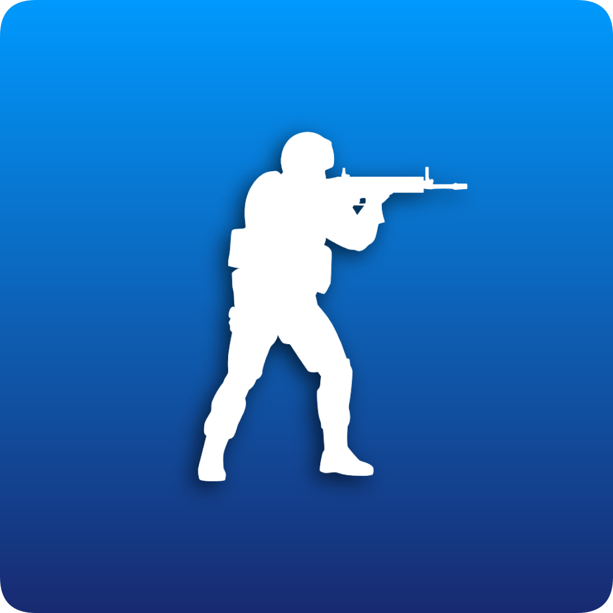

# CS:GO Queue Bot &ensp; 
*A Discord bot to manage and setup CS:GO games*

This script uses the Discord Python API via a bot to manage queues of CS:GO players who want to play with other Discord server members. It is complete with a queueing system, team drafter, map drafter and a link to a unique PopFlash lobby.


## Setup
1. First you must have a bot instance to run this script on. Follow Discord's tutorial [here](https://discord.onl/2019/03/21/how-to-set-up-a-bot-application/) on how to set one up. Be sure to invite it to a server to use it.

   * The permissions integer necessary is `17067072`.

2. Run `pip3 install -r requirements.txt` in the repository's root directory to get the necessary libraries.

    * Note that python-Levenshtein requires your system to have a C++ compiler (Visual Studio C++ compiler for Windows or g++ for Linux). This library may be replaced in the future to eliminate this requirement.

3. Add the `/qbot` path to your `PYTHONPATH` environment variable to be able to import it from anywhere.

4. Using your bot's Discord token and Discord Bot List token, run the bot like so...

```python
import qbot

DISCORD_TOKEN = 'XXXXXXXX'
qbot.run(discord_token=DISCORD_TOKEN)
```

Now you are ready to start using the CS:GO Queue Bot! Try out some of the commands to make sure it works.

*Note that currently the `mdraft` command depends on custom emojis to be used as buttons which are hardcoded [here](https://github.com/loserCS/10mansbot/blob/main/qbot/cogs/mapdraft.py#L20). As of right now you will need to make the emojis yourself and replace the emoji code in the map objects there.*

## Commands
`q!help` **-** Display help menu<br>

`q!about` **-** Display basic info about this bot<br>

`q!join` **-** Join the queue<br>

`q!leave` **-** Leave the queue<br>

`q!view` **-** Display who is currently in the queue<br>

`q!remove <mention>` **-** Remove the mentioned user from the queue (must have server kick perms)<br>

`q!empty` **-** Empty the queue (must have server kick perms)<br>

`q!cap <integer>` **-** Set the capacity of the queue to the specified value (must have admin perms)<br>
*This command is only available when the generic argument is set to true* 

`q!tdraft` **-** Start (or restart) a team draft from the last popped queue<br>

`q!mdraft` **-** Start (or restart) a map draft<br>

`q!setmp {+|-}<map name> ...` **-** Add or remove maps from the mdraft map pool (Must have admin perms)<br>

`q!popflash` **-** Link the server's designated PopFlash lobby<br>

`q!donate` **-** Link the bot's donation link<br>

`q!remind` **-** Set a reminder to ping you after specified time<br>
